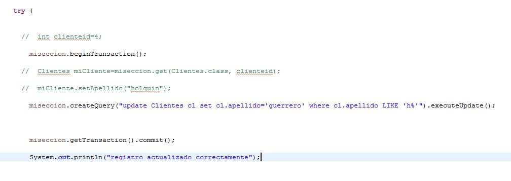

# JPA con Hibernate Practica 
### 1) se crea primero una base de datos con una sola entidad en MySQLWorkbench
###  tambien configuracion de archivo xml Hibernate para conexion a base de datos  
###  los datos ingresados en la clase cliente se hacen atraves de Hibernate imagenes parte de abajo
___

 

___

## hibernate.cfg.xml

___

___
### 2)  se crea la clase Clientes  con con sus setter y getter mas etiquetas de jpa que usa hibernate
### se le asigna clientes para realizar consultas HQL  

## mas etiquetas jpa para especificar columnas 

___
### 3) se ingresa datos vistos en el punto numero 1 con la seccion  en  hibernate
## 

## se realizan tambien consultas Read HQL 

## consultas Update HQL 

